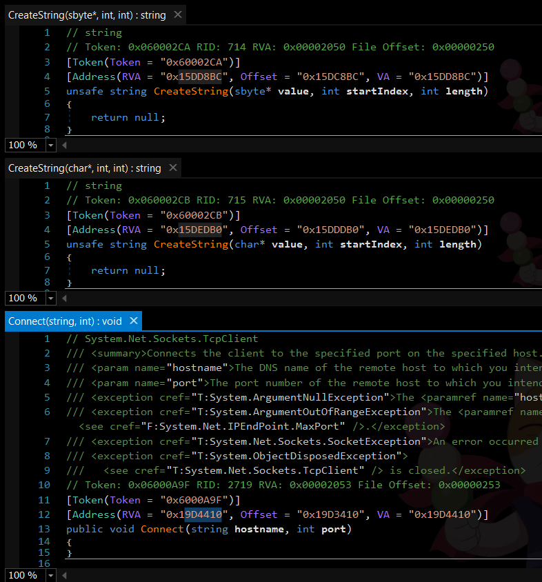
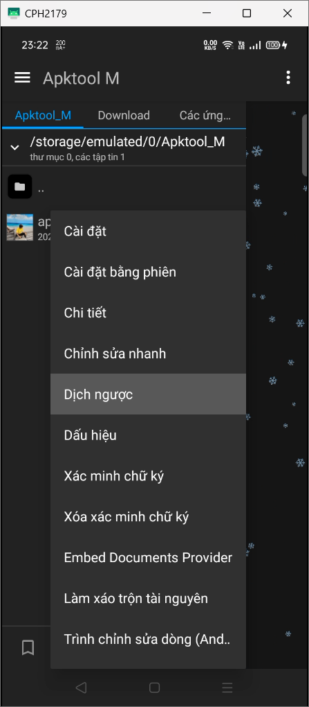
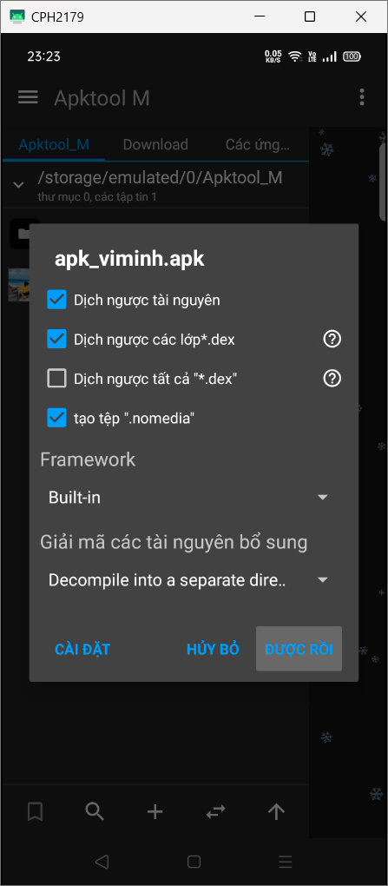
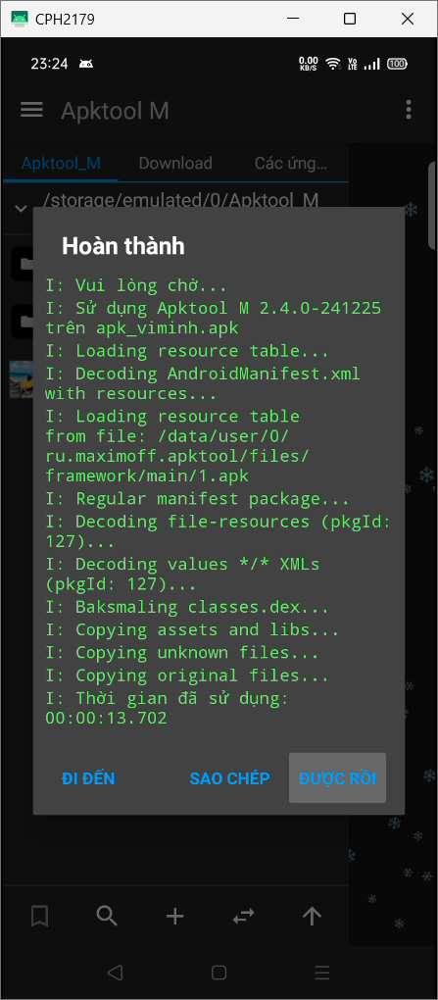
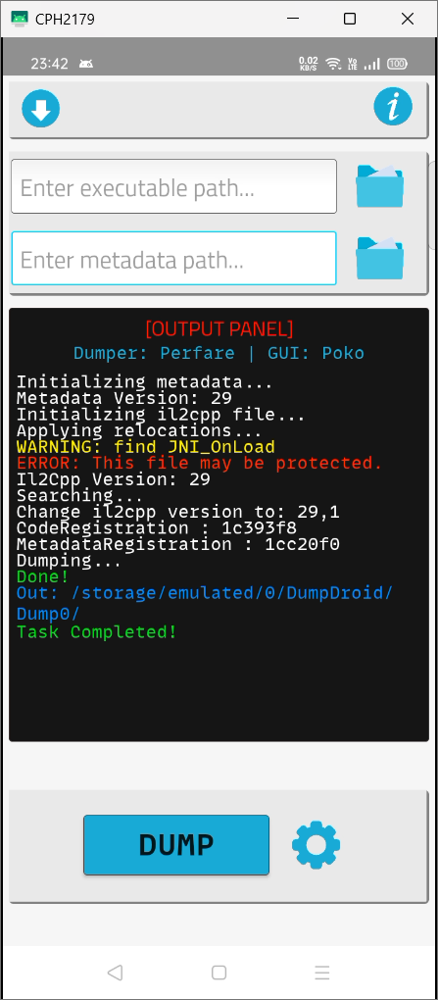
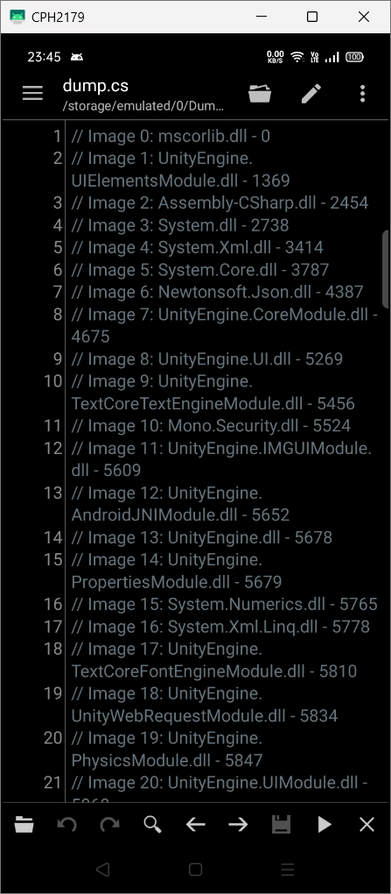
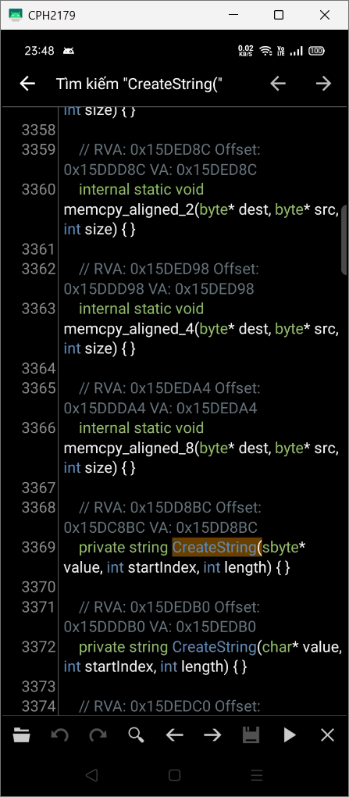
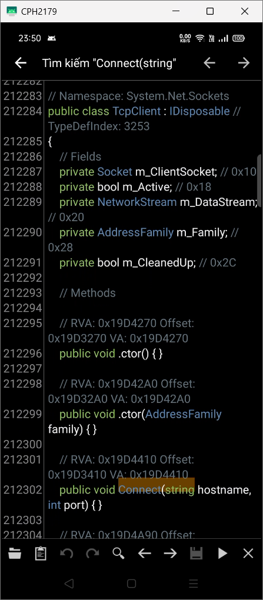

# Yes, the RVA (Relative Virtual Address) of functions is no longer relevant.
You can go back to the previous page or change the `Code` page to read the commented-out documentations.
<!-- # Lấy RVA (Relative Virtual Address) của các hàm
## Windows
- Tải và giải nén bản phát hành mới nhất của [Il2CppDumper](https://github.com/Perfare/Il2CppDumper).
- Làm theo [hướng dẫn của IL2CPPDumper](https://github.com/Perfare/Il2CppDumper?tab=readme-ov-file#usage) để tạo ra các tệp dll.
- Mở `mscorlib.dll` và `System.dll` trong thư mục `DummyDll` mới được tạo ra bằng [dnSpy](https://github.com/dnSpyEx/dnSpy).
- Trong `mscorlib.dll`, điều hướng đến namespace `System`, class `String` và tìm 2 hàm `unsafe string CreateString(sbyte* value, int startIndex, int length)` và `unsafe string CreateString(char* value, int startIndex, int length)`.
- Trong `System.dll`, điều hướng đến namespace `System.Net.Sockets`, class `TcpClient` và tìm hàm `public void Connect(string hostname, int port)`.
- RVA của các hàm này nằm trong attribute `Il2CppDummyDll.AddressAttribute`, biến `RVA` ở dạng thập lục phân. 
 
## Android
- Cài đặt các ứng dụng sau:
  - [Apktool M](https://maximoff.su/apktool/?lang=en)
  - [Bản phát hành mới nhất](https://github.com/Poko-Apps/Il2cppDumpDroidGUI/releases/latest) của [Il2CppDumperGUI](https://github.com/Poko-Apps/Il2cppDumpDroidGUI/)
  - Trình soạn thảo văn bản [QuickEdit](https://play.google.com/store/apps/details?id=com.rhmsoft.edit)
- Dịch ngược tệp APK bằng Apktool M:
  - Chọn tệp APK cần dịch ngược và nhấn vào `Dịch ngược`
   
  - Ở cửa sổ tiếp theo, chọn `Được rồi`
   
  - Đợi cho quá trình dịch ngược hoàn tất, sau đó chọn `Được rồi`
   
- Mở Il2CppDumperGUI và nhập đường dẫn đến tệp `libil2cpp.so` trong thư mục `lib/[kiến trúc máy của bạn]` của thư mục mã nguồn đã dịch ngược vào trường `Enter executable path...`
  - Bạn có thể nhấn vào biểu tượng thư mục ở bên phải để chọn tệp.
  - Kiến trúc của máy có thể được xem bằng cách tải ứng dụng [AIDA64](https://play.google.com/store/apps/details?id=com.finalwire.aida64).
- Nhập đường dẫn đến tệp `global-metadata.dat` trong thư mục `assets/bin/Data/Managed/Metadata` của thư mục mã nguồn đã dịch ngược vào trường `Enter metadata path...`
  - Bạn có thể nhấn vào biểu tượng thư mục ở bên phải để chọn tệp.
- Nhấn `Dump` và chờ cho quá trình hoàn tất.
 
- Mở tệp `dump.cs` được tạo ra trong thư mục được ghi trong nhật ký của Il2CppDumperGUI bằng trình soạn thảo văn bản QuickEdit.
 
- Tìm `CreateString(` để lấy RVA của hàm `System.String::CreateString(System.Sbyte* value, System.Int32 startIndex, System.Int32 length)` và `System.String::CreateString(System.Char* value, System.Int32 startIndex, System.Int32 length)`.
 
  - Tìm `Connect(` để lấy RVA của hàm `System.Net.Sockets.TcpClient::Connect(System.String hostname, System.Int32 port)`.
 
## Thứ tự các hàm
Thứ tự RVA của các hàm trong NROIPChanger Android như sau:
1. `System.String::CreateString(System.Sbyte* value, System.Int32 startIndex, System.Int32 length)` trong `mscorlib.dll`.
2. `System.String::CreateString(System.Char* value, System.Int32 startIndex, System.Int32 length)` trong `mscorlib.dll`.
3. `System.Net.Sockets.TcpClient::Connect(System.String hostname, System.Int32 port)` trong `System.dll`. -->