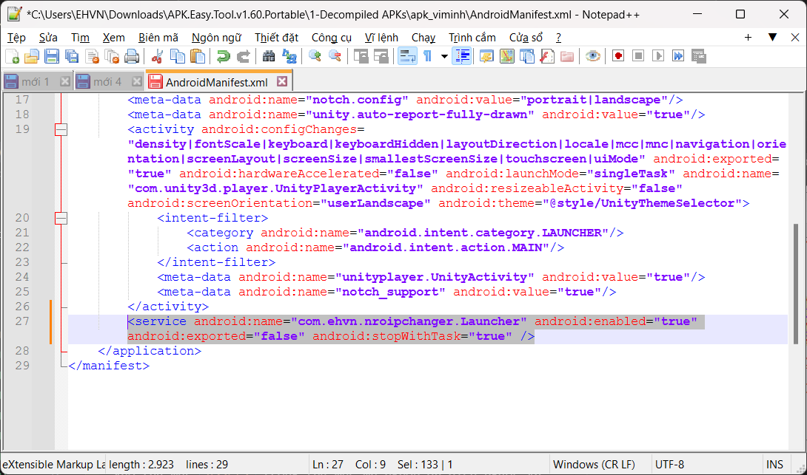

# Cài đặt cho Android
NROIPChanger trên Android có 2 loại:
- [NROIPChanger.IL2CPP.Android.Minimalistic](../NROIPChanger.IL2CPP.Android.Minimalistic/) (gọi là `MIN`): 
  - Địa chỉ máy chủ mới là cố định
  - Không thể tắt chức năng đổi IP
  - Không thể buộc đổi địa chỉ IP khi ứng dụng khách kết nối đến `Localhost`
  - Chỉ có thể thay đổi khi sửa đổi tệp APK (không thể thay đổi sau khi cài đặt vào thiết bị mà không biên dịch lại tệp APK)
- [NROIPChanger.IL2CPP.Android](../NROIPChanger.IL2CPP.Android/) (gọi là `FULL`): 
  - Địa chỉ máy chủ mới có thể thay đổi từ trong game
  - Có thể bật/tắt chức năng đổi IP
  - Có thể buộc đổi địa chỉ IP khi ứng dụng khách kết nối đến `Localhost`
  - Chỉ cần sửa đổi tệp APK một lần duy nhất.

*__Lưu ý__*: Bạn không thể cài đặt cả 2 loại trên 1 tệp APK.
## Sửa đổi tệp APK trên Windows và cài đặt trên Android
- Tải xuống [bản phát hành mới nhất](https://github.com/mkcs121/APK-Easy-Tool/releases) của [APK Easy Tool](https://github.com/mkcs121/APK-Easy-Tool) và giải nén.
<br>
- Tải xuống và giải nén [NROIPChanger Android](../../../releases/latest/download/NROIPChanger.Android.zip).
- Tải xuống [phiên bản mới nhất](https://github.com/iBotPeaches/Apktool/releases/) của [Apktool](https://github.com/iBotPeaches/Apktool/) và di chuyển tệp .jar đã tải xuống vào thư mục `Apktool` bên trong thư mục đã giải nén [APK Easy Tool](https://github.com/mkcs121/APK-Easy-Tool). Thư mục sẽ tương tự như sau:
<br>
- Chạy `apkeasytool.exe` và chỉnh sửa phiên bản Apktool thành phiên bản Apktool bạn vừa tải xuống:
<br>
- Dịch ngược tệp APK cần chỉnh sửa bằng cách kéo tệp APK của game vào cửa sổ chương trình, sau đó nhấn `Decompile` và đợi cho quá trình dịch ngược hoàn tất.
<br>
- Nhấn `Decompiled APK directory` để mở thư mục chứa các thư mục mã nguồn đã dịch ngược, sau đó mở thư mục có tên trong trường `Decompile name`.
<br>
- Mở tệp `AndroidManifest.xml` bằng trình soạn thảo văn bản ưa thích của bạn.
- Tìm `MainActivity` của game: 
  - Tìm `<action android:name="android.intent.action.MAIN"/>` trong `AndroidManifest.xml`. 
  - Tìm kiếm 2-3 dòng ở trên xem có dòng nào có nội dung giống như `<activity ...>` không.
  - Nếu có, nội dung trong dấu ngoặc kép sau `android:name=` trong dòng đó chính là `MainActivity` của game.

VD: Nếu nội dung tệp `AndroidManifest.xml` như sau:
```xml
...
<activity android:configChanges="density|fontScale|keyboard|keyboardHidden|layoutDirection|locale|mcc|mnc|navigation|orientation|screenLayout|screenSize|smallestScreenSize|touchscreen|uiMode" android:exported="true" android:hardwareAccelerated="false" android:launchMode="singleTask" android:name="com.unity3d.player.UnityPlayerActivity" android:resizeableActivity="false" android:screenOrientation="userLandscape" android:theme="@style/UnityThemeSelector">
    <intent-filter>
        <category android:name="android.intent.category.LAUNCHER"/>
        <action android:name="android.intent.action.MAIN"/>
    </intent-filter>
    <meta-data android:name="unityplayer.UnityActivity" android:value="true"/>
    <meta-data android:name="notch_support" android:value="true"/>
</activity>
...
```
`MainActivity` của game là `com.unity3d.player.UnityPlayerActivity`.


- **Nếu bạn cài đặt phiên bản `FULL`:**
  - Thêm dòng sau vào ngay trên dòng có nội dung giống tương tự `<application ...>` nếu như bạn không thấy dòng này:
    ```xml
    <uses-permission android:name="android.permission.SYSTEM_ALERT_WINDOW"/>
    ```
    <br>
  - Thêm dòng sau vào ngay trên dòng `</application>` ở gần cuối:
    ```xml
    <service android:name="com.ehvn.nroipchanger.Launcher" android:enabled="true" android:exported="false" android:stopWithTask="true" />
    ```
    <br>
<!-- - **Nếu bạn cài đặt phiên bản `MIN` HOẶC bạn cài đặt phiên bản `FULL` và muốn đặt giá trị mặc định cho địa chỉ máy chủ và/hoặc địa chỉ hook:**
  - Vào thư mục `assets` trong thư mục mã nguồn đã dịch ngược và tạo 2 tệp: `ip_server` và `hook_addresses`.
  <br>
  - Mở tệp `ip_server` và nhập địa chỉ máy chủ mới vào. Địa chỉ máy chủ phải có định dạng: `<IP>:<Port>`. VD: `dragon1.teamobi.com:1234`. Đảm bảo tệp được kết thúc bằng dấu xuống dòng.
  <br>
  - Mở tệp `hook_addresses` và nhập RVA của các hàm được đề cập trong [Lấy RVA của các hàm](./Getting-Function-RVAs.md), phân tách bằng ký tự `|` và kết thúc bằng số 0. VD: `6E513E|5FBD34|89A391|0`.
  <br>
  - *__Lưu ý__*: phiên bản `MIN` yêu cầu cả 2 tệp phải được tạo, còn phiên bản `FULL` chỉ yêu cầu 1 trong 2 tệp được tạo. Nếu có tệp `ip_server`, địa chỉ máy chủ mặc định khi mới cài đặt sẽ là địa chỉ máy chủ trong tệp `ip_server`. Nếu có tệp `hook_addresses`, địa chỉ hook mặc định khi mới cài đặt sẽ là địa chỉ hook trong tệp `hook_addresses`. -->
- Nếu bạn muốn đặt giá trị mặc định cho địa chỉ máy chủ:
  - Vào thư mục `assets` trong thư mục mã nguồn đã dịch ngược và tạo tệp `ip_server`.
  <br>
  - Mở tệp `ip_server` và nhập địa chỉ máy chủ mới vào. Địa chỉ máy chủ phải có định dạng: `<IP>:<Port>`. VD: `dragon1.teamobi.com:1234`. Đảm bảo tệp được kết thúc bằng dấu xuống dòng.
  <br>
  - Địa chỉ máy chủ mặc định khi mới cài đặt sẽ là địa chỉ máy chủ trong tệp `ip_server`.
- Kiểm tra các thư mục `smali` và `smali_classes` trong thư mục mã nguồn đã dịch ngược để tìm tệp smali `MainActivity` của game.
  - VD: Nếu `MainActivity` của game là `com.unity3d.player.UnityPlayerActivity`, bạn cần tìm tệp `UnityPlayerActivity.smali` trong thư mục `com/unity3d/player` trong các thư mục `smali` và `smali_classes`.
  <br>
- Mở tệp smali `MainActivity` và tìm `.method protected onCreate(`.
- Dán đoạn mã sau vào 2 dòng dưới dòng vừa tìm được:
  ```smali
  invoke-static {p0}, Lcom/ehvn/nroipchanger/Main;->Start(Landroid/content/Context;)V
  ```
  <br>
- Mở thư mục mà bạn đã giải nén [NROIPChanger Android](../../../releases/latest/download/NROIPChanger.Android.zip) trước đó, sau đó sao chép thư mục `com` bên trong thư mục `Smali` `MIN`/`FULL` vào thư mục `smali` trong thư mục mã nguồn đã dịch ngược.
  - Nếu thư mục đã dịch ngược có nhiều thư mục `smali_classes`, hãy chọn thư mục `smali_classes` có số lớn nhất.
  <br>
- Sao chép các tệp `libNROIPChanger` Vào các thư mục bên trong thư mục `lib` trong thư mục mã nguồn đã dịch ngược:
  - Nếu bạn thấy thư mục `armeabi-v7a`, hãy sao chép tệp `libNROIPChanger` `MIN`/`FULL` `_ARM.so` vào thư mục `armeabi-v7a` và đổi tên nó thành `libNROIPChanger.so`.
  - Làm tương tự với `libNROIPChanger` `MIN`/`FULL` `_ARM64.so` cho thư mục `arm64-v8a`, `x86` cho thư mục `x86` và `x64` cho thư mục `x86_64`.
  <br>
- Biên dịch APK bằng cách nhấn `Compile` trong [APK Easy Tool](https://github.com/mkcs121/APK-Easy-Tool) và đợi cho quá trình biên dịch hoàn tất.
<br>

- Cài đặt tệp APK đã biên dịch vào thiết bị Android của bạn. Thư mục chứa tệp APK đã biên dịch có thể được truy cập bằng cách nhấn `Compiled APK directory` trong [APK Easy Tool](https://github.com/mkcs121/APK-Easy-Tool).
<br>

- **Nếu bạn cài đặt phiên bản `FULL`:**
  - Khi mở game sẽ yêu cầu cấp quyền hiển thị trên các ứng dụng khác. Hãy cấp quyền này cho ứng dụng game.
  - Sau khi cấp quyền và quay trở lại game, một biểu tượng mới sẽ xuất hiện (hay còn gọi là Floating Menu). Nhấn vào biểu tượng này để mở menu của NROIPChanger.
  - Nhập địa chỉ máy chủ mới vào trường `Địa chỉ IP mới` và cổng mới vào trường `Cổng mới`.
  <!-- - Mở rộng phần `Địa chỉ hook` và nhập RVA của các hàm được đề cập trong [Lấy RVA của các hàm](./Getting-Function-RVAs.md) vào các trường tương ứng. -->
  <!-- - Khởi động lại để thay đổi được áp dụng. -->
  <!-- - Mở menu và bật công tắc `Kích hoạt` để bật chức năng đổi IP. -->
  - Bật công tắc `Hiện thông báo` nếu bạn muốn xem địa chỉ máy chủ gốc.
  - Bật công tắc `Kích hoạt` để bật chức năng đổi IP.
  - Nhấn nút `Thu nhỏ` để thu nhỏ menu, `Ẩn/Đóng (giữ)` để ẩn menu và nhấn giữ nút `Ẩn/Đóng (giữ)` để đóng menu.<br>
  <br>
## Sửa đổi và cài đặt tệp APK trên Android
- Tải xuống và giải nén [NROIPChanger Android](../../../releases/latest/download/NROIPChanger.Android.zip).
- Cài đặt [Apktool M](https://maximoff.su/apktool/?lang=en).
- Dịch ngược tệp APK bằng Apktool M:
  - Chọn tệp APK cần dịch ngược và nhấn vào `Dịch ngược`
  <br>
  - Ở cửa sổ tiếp theo, chọn `Được rồi`
  <br>
  - Đợi cho quá trình dịch ngược hoàn tất, sau đó chọn `Được rồi`
  <br>
- Tìm `MainActivity` của game: 
  - Chọn tệp APK đã dịch ngược, sau đó chọn `Chi tiết`. Nội dung của `Hoạt động khởi động` là `MainActivity` của game.
  <br>
- **Nếu bạn cài đặt phiên bản `FULL`:**
  - Mở tệp `AndroidManifest.xml` trong thư mục mã nguồn đã dịch ngược trong Apktool M.
  <br>
  - Thêm dòng sau vào ngay trên dòng có nội dung tương tự `<application ...>` nếu như bạn không thấy dòng này:
    ```xml
    <uses-permission android:name="android.permission.SYSTEM_ALERT_WINDOW"/>
    ```
    <br>
  - Thêm dòng sau vào ngay trên dòng `</application>` ở gần cuối:
    ```xml
    <service android:name="com.ehvn.nroipchanger.Launcher" android:enabled="true" android:exported="false" android:stopWithTask="true" />
    ```
    <br>
<!-- - **Nếu bạn cài đặt phiên bản `MIN` HOẶC bạn cài đặt phiên bản `FULL` và muốn đặt giá trị mặc định cho địa chỉ máy chủ và/hoặc địa chỉ hook:**
  - Vào thư mục `assets` trong thư mục mã nguồn đã dịch ngược và tạo 2 tệp: `ip_server` và `hook_addresses`.
  <br>
  - Mở tệp `ip_server` và nhập địa chỉ máy chủ mới vào. Địa chỉ máy chủ phải có định dạng: `<IP>:<Port>`. VD: `dragon1.teamobi.com:1234`. Đảm bảo tệp được kết thúc bằng dấu xuống dòng.
  <br>
  - Mở tệp `hook_addresses` và nhập RVA của các hàm được đề cập trong [Lấy RVA của các hàm](./Getting-Function-RVAs.md), phân tách bằng ký tự `|` và kết thúc bằng số 0. VD: `6E513E|5FBD34|89A391|0`.
  <br>
  - *__Lưu ý__*: phiên bản `MIN` yêu cầu cả 2 tệp phải được tạo, còn phiên bản `FULL` chỉ yêu cầu 1 trong 2 tệp được tạo. Nếu có tệp `ip_server`, địa chỉ máy chủ mặc định khi mới cài đặt sẽ là địa chỉ máy chủ trong tệp `ip_server`. Nếu có tệp `hook_addresses`, địa chỉ hook mặc định khi mới cài đặt sẽ là địa chỉ hook trong tệp `hook_addresses`. -->
- Nếu bạn muốn đặt giá trị mặc định cho địa chỉ máy chủ:
  - Vào thư mục `assets` trong thư mục mã nguồn đã dịch ngược và tạo tệp `ip_server`.
  <br>
  - Mở tệp `ip_server` và nhập địa chỉ máy chủ mới vào. Địa chỉ máy chủ phải có định dạng: `<IP>:<Port>`. VD: `dragon1.teamobi.com:1234`. Đảm bảo tệp được kết thúc bằng dấu xuống dòng.
  <br>
  - Địa chỉ máy chủ mặc định khi mới cài đặt sẽ là địa chỉ máy chủ trong tệp `ip_server`.
- Kiểm tra các thư mục `smali` và `smali_classes` trong thư mục mã nguồn đã dịch ngược để tìm tệp smali `MainActivity` của game.
  - VD: Nếu `MainActivity` của game là `com.unity3d.player.UnityPlayerActivity`, bạn cần tìm tệp `UnityPlayerActivity.smali` trong thư mục `com/unity3d/player` trong các thư mục `smali` và `smali_classes`.
  <br>
- Mở tệp smali `MainActivity` và tìm `.method protected onCreate(`.
- Dán đoạn mã sau vào 2 dòng dưới dòng vừa tìm được:
  ```smali
    invoke-static {p0}, Lcom/ehvn/nroipchanger/Main;->Start(Landroid/content/Context;)V
  ```
  <br>
- Mở thư mục mà bạn đã giải nén [NROIPChanger Android](../../../releases/latest/download/NROIPChanger.Android.zip) trước đó, sau đó sao chép thư mục `com` bên trong thư mục `Smali` `MIN`/`FULL` vào thư mục `smali` trong thư mục mã nguồn đã dịch ngược.
  - Nếu thư mục đã dịch ngược có nhiều thư mục `smali_classes`, hãy chọn thư mục `smali_classes` có số lớn nhất.
  <br>
- Sao chép các tệp `libNROIPChanger` Vào các thư mục bên trong thư mục `lib` trong thư mục mã nguồn đã dịch ngược:
  - Nếu bạn thấy thư mục `armeabi-v7a`, hãy sao chép tệp `libNROIPChanger` `MIN`/`FULL` `_ARM.so` vào thư mục `armeabi-v7a` và đổi tên nó thành `libNROIPChanger.so`.
  - Làm tương tự với `libNROIPChanger` `MIN`/`FULL` `_ARM64.so` cho thư mục `arm64-v8a`, `x86` cho thư mục `x86` và `x64` cho thư mục `x86_64`.
  <br>
- Biên dịch APK bằng cách nhấn `Biên soạn dự án này`, sau đó nhấn `Được rồi` và đợi cho quá trình biên dịch hoàn tất.
<br>

- Cài đặt tệp APK đã biên dịch và mở game.
<br>

- **Nếu bạn cài đặt phiên bản `FULL`:**
  - Khi mở game sẽ yêu cầu cấp quyền hiển thị trên các ứng dụng khác. Hãy cấp quyền này cho ứng dụng game.
  - Sau khi cấp quyền và quay trở lại game, một biểu tượng mới sẽ xuất hiện (hay còn gọi là Floating Menu). Nhấn vào biểu tượng này để mở menu của NROIPChanger.
  - Nhập địa chỉ máy chủ mới vào trường `Địa chỉ IP mới` và cổng mới vào trường `Cổng mới`.
  <!-- - Mở rộng phần `Địa chỉ hook` và nhập RVA của các hàm được đề cập trong [Lấy RVA của các hàm](./Getting-Function-RVAs.md) vào các trường tương ứng. -->
  <!-- - Khởi động lại để thay đổi được áp dụng. -->
  <!-- - Mở menu và bật công tắc `Kích hoạt` để bật chức năng đổi IP. -->
  - Bật công tắc `Hiện thông báo` nếu bạn muốn xem địa chỉ máy chủ gốc.
  - Bật công tắc `Buộc đổi IP từ Localhost` nếu game kết nối đến Localhost thay vì địa chỉ 1 máy chủ nào đó.
  - Bật công tắc `Kích hoạt` để bật chức năng đổi IP.
  - Nhấn nút `Thu nhỏ` để thu nhỏ menu, `Ẩn/Đóng (giữ)` để ẩn menu và nhấn giữ nút `Ẩn/Đóng (giữ)` để đóng menu.<br>
  <br>