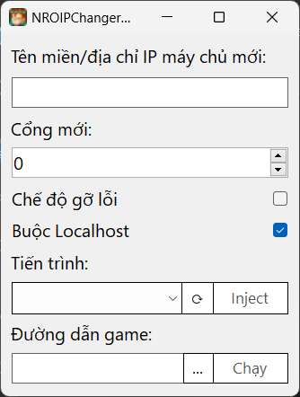

# Cài đặt trên Windows
- Tải [NROIPChanger Desktop](../../../releases/latest/download/NROIPChanger.Desktop.zip) và giải nén. 
- Chạy `NROIPChanger.GUI.Desktop.exe` và điền tên miền/địa chỉ IP máy chủ mới vào các trường tương ứng.
- Nếu bạn đã mở game, chọn tiến trình game của bạn trong danh sách tiến trình và nhấn nút `Inject`.
  - Nếu bạn không thấy tiến trình game của mình trong danh sách, hãy nhấn nút `⟳` ở bên phải danh sách để tải lại danh sách tiến trình.
   
- Nếu bạn chưa mở game, nhập đường dẫn tới tệp exe của game vào trường `Đường dẫn game` và nhấn nút `Chạy`.
  - Bạn có thể nhấn nút `...` bên phải trường `Đường dẫn game` để mở hộp thoại chọn tệp và chọn tệp exe của game.
   
  - Chọn hộp kiểm `Buộc Localhost` nếu game kết nối đến Localhost thay vì địa chỉ 1 máy chủ nào đó.
   
- Nếu bạn muốn xem địa chỉ máy chủ gốc, chọn hộp kiểm `Chế độ gỡ lỗi`.
  - Một cửa sổ dòng lệnh sẽ mở ra và hiện địa chỉ máy chủ gốc. Nếu bạn đóng cửa sổ này, game sẽ bị đóng.
   

*__Lưu ý__*: Game sẽ vẫn hiện tên máy chủ gốc trong danh sách máy chủ, trong khi đó địa chỉ máy chủ đã được thay đổi. Bạn không cần phải lo lắng về điều này.